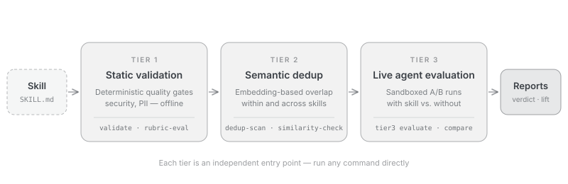

SkillEvaluator is an open-source, multi-tier framework for evaluating AI agent artifacts, starting with agent skills: deterministic quality gates, semantic overlap detection, synthetic eval dataset generation, and live agent evaluation.

Agent skills are folders of instructions and supporting files that extend AI agents, as defined by the [Agent Skills specification](https://agentskills.io/). SkillEvaluator is part of the [NVIDIA Verified Skills pipeline](https://docs.nvidia.com/skills/), published from the [NVIDIA/skills catalog](https://github.com/NVIDIA/skills). Tier 1 integrates [SkillSpector](https://github.com/NVIDIA/SkillSpector) for specialized security scanning; see [Installation](installation.mdx#system-tools) for the security setup.

<Note>
  SkillEvaluator's support level is **Experimental**: community-supported on a best-effort basis through [GitHub Issues](https://github.com/NVIDIA/SkillEvaluator/issues), with no SLA. See [SUPPORT.md](https://github.com/NVIDIA/SkillEvaluator/blob/main/SUPPORT.md).
</Note>

## The three tiers

Each tier answers one question about your skill.

<CardGroup cols={3}>
  <Card title="Tier 1: Validation" href="tier1-validation.mdx">
    **Is this skill safe and well-formed?** Deterministic schema, quality, security, PII, license, and script checks that run offline — plus optional LLM-as-judge scoring.
  </Card>
  <Card title="Tier 2: Deduplication" href="tier2-deduplication.mdx">
    **Does it overlap with what exists?** Embedding similarity finds repeated guidance inside one skill and overlapping skills across a collection or catalog.
  </Card>
  <Card title="Tier 3: Live Evaluation" href="tier3-live-evaluation.mdx">
    **Does it actually help the agent?** A real agent runs generated tasks with and without the skill, inside a sandbox, and the difference is measured.
  </Card>
</CardGroup>

Every tier is an independent entry point — run any command directly; nothing requires running the earlier tiers first.

| Tier | Representative commands | Requires |
| --- | --- | --- |
| [Tier 1](tier1-validation.mdx) | `validate`, `quality-check`, `security-scan`, `pii-scan`, `lint-scripts`, `rubric-eval` | No API key for deterministic checks; the `security` extra plus external Semgrep, SkillSpector, and Gitleaks executables for full scanner coverage; a provider key for LLM checks |
| [Tier 2](tier2-deduplication.mdx) | `context-optimization-check`, `similarity-check` | An embeddings provider; intra-skill analysis also needs a chat LLM — local OpenAI-compatible endpoints work |
| [Tier 3](tier3-live-evaluation.mdx) | `create-eval-dataset`, `tier3 evaluate`, `compare` | No credential for keyless templates and report inspection; a provider key for LLM generation and grading; live evaluation also needs the agent CLI with its credential and a Docker, local OS, or cloud sandbox |

## Try it in two minutes

Install with [uv](https://docs.astral.sh/uv/) and run the keyless quality check against your own skill — no API key, Docker, Gitleaks, or repository clone required:

```bash title="No API key required"
uv tool install --python 3.13 "skillevaluator[all] @ git+https://github.com/NVIDIA/SkillEvaluator.git"
skillevaluator quality-check ./my-skill
```

You get a 0–100 quality score with an A–F grade. From there, the [Quickstart](quickstart.mdx) walks through a complete offline Tier 1 run and wiring up a provider for the LLM-backed parts.

## How a run flows

<Frame background="subtle" caption="The SkillEvaluator three-tier pipeline">
  
</Frame>

Tier 1's deterministic gates run offline. Tier 2 and the optional Tier 1 LLM checks need a provider key, and Tier 3 adds the agent credential and a sandbox. Every run ends in [reports](reports.mdx) — CLI, JSON, HTML, or Markdown.

## What Tier 3 measures

- **Five dimensions** — Security, Correctness, Discoverability, Effectiveness, and Efficiency: human-readable scores that lead every standard grading report.
- **Skill Lift** — the measured difference between the with-skill and without-skill runs; the number that says whether the skill earns its place.
- **pass@k** — multi-attempt reliability, reported separately from the dimension scores.

How to read all three, and the on-disk results contract, live in [Reports & Results](reports.mdx).

## Explore the docs

<CardGroup cols={2}>
  <Card title="Quickstart" icon="rocket" href="quickstart.mdx">
    First evaluation result in about two minutes, no API key.
  </Card>
  <Card title="Gate Your CI" icon="shield" href="ci-integration.mdx">
    Make SkillEvaluator a merge gate — exit codes, a GitHub Actions recipe, and progressive adoption.
  </Card>
  <Card title="CLI Reference" icon="terminal" href="cli-reference.mdx">
    Every command, every flag, exact defaults.
  </Card>
  <Card title="Contributing" icon="book" href="developer-guide.mdx">
    Dev environment, tests, docs workflow, and how to submit a change.
  </Card>
</CardGroup>

- [SkillEvaluator on GitHub](https://github.com/NVIDIA/SkillEvaluator)
- [Support](https://github.com/NVIDIA/SkillEvaluator/blob/main/SUPPORT.md) — best-effort, through GitHub Issues
- [Security policy](https://github.com/NVIDIA/SkillEvaluator/blob/main/SECURITY.md) — report vulnerabilities privately, never in a public issue
- [License](https://github.com/NVIDIA/SkillEvaluator/blob/main/LICENSE) — Apache-2.0
